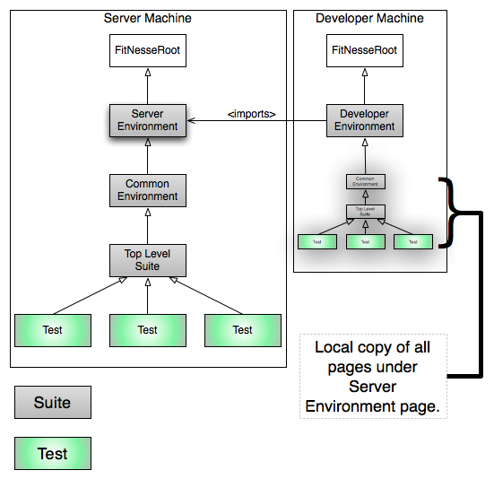

{:toc}
## Background
There are several ways to organize a team's use of FitNesse. This document mentions one and describes a second one in some detail. The two models are the "FitNesse as an Editor" model and the "FitNesse Server" model.

## The Models in a Nutshell
### FitNesse as an Editor
There are several ways to layout pages using FitNesse. One mechanism is to keep FitNesseRoot checked into your favorite repository and developers simply check it out on their local machine. Updating a test involves the following steps:
* Update local copy of FitNesseRoot
* Start FitNesse (if necessary)
* Update a test page
* Update local copy of FitNesseRoot
* Check in changes

This is a straightforward mechanism with a few issues:
* People who do not normally use tools like Subversion, git, etc., might have to learn to use such tools
* It increases the time between updating a page and making it available (compared to the server model below), exposing the possibility of merge conflicts
* It forces people to either have files and resources in the same location or environment (external to FitNesse) configuration.

However, these are minor nuisances. In many cases, the people writing acceptance tests in FitNesse are quite comfortable with such tools and the change frequency of acceptance tests is such that merge conflicts do not happen too often in practice.

The last bullet is both a strength and weakness. Forcing the machines to have similar configurations can actually remove problems over time. It also discourages one-off solutions as they will immediately break on other machines.

### FitNesse Server
In this configuration, there is a master FitNesse server. People working on tests have a local installation of FitNesse with a page that makes  a virtual link to the server pages. The server pages are shadowed on the local machine. People make updates remotely, making the changes immediately available. The FitNesse Server installation is configured to be backed up on a regular basis.

This second model is describe in more detail below.

## Setting up the FitNesse Server Model
This model has a few characteristics:
* Updates to tests are seen as soon as someone runs a test on their local FitNesse installation
* Backing up is (or should be) automatically configured
* Editing the same page is noticed sooner
* It is easier to have a local, machine-based, configuration
This is one mechanism you can use to allow for execution of tests with machine-relative settings configured into the page hierarchy. You can use this configuration to make it easy to have, for example, a "master" FitNesse server used to execute tests with its own class path and machine/environment specific settings, and still run tests on a local developer machine with its own settings.

## Overview
The picture gives a high level view. In a nutshell:

**On The Server**
* FitNesse is installed in some convenient location, with its FitNesseRoot directory and fitnesse.jar as siblings in some physical directory.
* The top level page captures environment settings specific to the current server. E.g., the build system puts jars in one location, whereas developers tend to execute FitNesse tests against compiled class files.
* The next level stores common imports and environment configuration, e.g., fitnesse.jar and !define TEST_SYSTEM {slim}.
* The next level is the top level test suite. In fact, you can configure all of the pages as suites to allow test execution from anywhere in the hierarchy.
* All tests fall under the top-level suite.

**On A Developer Machine**
* FitNesse is installed in some convenient location, with its FitNesseRoot directory and fitnesse.jar as siblings in some physical directory. (Same idea as server machine, but not necessarily the same directory.)
* The developer creates a top-level page specifying developer-machine-specific settings, such as the location of .class files and local copies of jar files.
* That same page uses the wiki import feature to point to the server environment page, which causes all of the pages under the server environment page to be copied to the developer machine.

When someone browses to the server machine and hits the test button, the environment settings are found on the server machine. When a developer browses to his/her machine and executes tests, the page hierarchy is different, so different settings are found and used for test execution.

A developer edits pages remotely rather than locally. The page is immediately updated on the server and picked up by other people. At the request of a colleague, I want to emphasize this:
* **Developers edit pages remotely, not locally**.

Why? So their work is immediately shared. These are meant to be collaborative. If for some reason you want to have "passing" and "in progress" tests, there are several mechanisms to manage this:
* Use tags, then have pages that include the tags and serve as suites.
* Use page hierarchies for the state of a test, moving (or linking) pages as they go from in progress, to passing.

In any case, **test writers should be editing remotely**.

## Detailed Steps
This set of steps describes how to simulate this on a single machine to practice. The only change to the real configuration is that you need to physically install FitNesse on a different machine.

### Setup Two FitNesse Servers

**Create a location for the "server machine".**

* Create a directory in some convenient location, I'll use ~/src/fitnesse_example/server.
* Under that directory copy fitnesse.jar and FitNesseRoot. The easiest way to accomplish this is to copy fitnesse.jar to ~/src/fitnesse_examples/server then type:


java -jar fitnesse.jar -p 9080


Note that this both creates the FitNesseRoot directory and starts FitNesse listening on port 9080.

**Create a location for the "developer machine"**

* Create a directry in some convenient location, I'll use ~/src/fitnesse_example/developer.
* Under that directory copy fitnesse.jar and FitNesseRoot. The easiest way to accomplish this is to copy fitnesse.jar to ~/src/fitnesse_examples/developer then type:


java -jar fitnesse.jar -p 8080


Note that this both creates the FitNesseRoot directory and starts FitNesse listening on port 8080.

In this example I use 2 different ports because each executing FitNesse server needs to have its own port and I'm running FitNesse on the same machine twice.

The rest of this example uses a simulated project called "Dvr" for DigitalVideoRecorder.

### Creating Server Page Hierarchy
#### Top Level Environment
* Go to <http:localhost:9080/>
* You should see the FitNesse start page.
* Update the URL to <http:localhost:9080/DvrServerEnvironment>
* FitNesse will prompt you to create the page.
* Simply save this page.
* Edit the page properties, set the type to **suite**.

#### Common Environment
* Go to <http:localhost:9080/DvrServerEnvironment.CommonEnviornment>
* On this page, set the contents to:


!define TEST_SYSTEM {slim}
!path fitnesse.jar

!contents -R2 -g -p -f -h


* Save the page.
* Edit the page properties, set the type to **suite**.

#### Create a top-level suite page

While not strictly necessary, this top-level page will remain stable while the common environment page might change. It is reasonable to merge the common environment and top-level suite pages, this example keeps them separate.
* Go to <http:localhost:9080/DvrServerEnvironment.CommonEnviornment.AllTests>
* Simply save this page
* Edit the page properties, set the type to **suite**.

#### Create a Common Setup
This SetUp page will apply to all children test pages that do not have SetUp pages. If you need to have multiple setup pages, you can use an import statement.
* Go to <http:localhost:9080/DvrServerEnvironment.CommonEnviornment.AllTests.SetUp>
* Set the page contents to:


|import|
|com.om.fitnesseexample|


#### Create an Example Test
This is a simple test we'll use to verify that things are working.
* Create a test page under the top level suite by going to this link: <http:localhost:9080/DvrServerEnvironment.CommonEnviornment.AllTests.SimpleExample>. This page is a sibling of the SetUp page, so it will automatically pickup the SetUp page. Also note that since the page name ends in "Example" it will automatically be created as a test page.
* Set this page's contents to:


!|IsThisTheServer|
|server?|
|true|


### Get Server Test Passing

Now you'll create a single Eclipse workspace with two projects. One project will have code that will be executed on the server installation of FitNesse, the other will have code executed by the Developer installation of FitNesse.
* Create a new Eclipse project. For this example, I'll create the new workspace at /Users/schuchert/src/FitNesseLinkPageExample
* Create a new Java project called "server" in this workspace.
* Create the following class (making sure to mirror the package):


package com.om.fitnesseexample;

public class IsThisTheServer {
  public boolean server() {
    return true;
  }
}


The server needs to know where to look for java classes. We will configure this on the server configuration page. By default, Eclipse will compile this and put the classes in /Users/schuchert/src/FitNesseLinkPageExample/server/bin. You might need to search for the top-level class directory.
* Edit the server configuration page by going to this link: <http:localhost:9080/DvrServerEnvironment>
* Set the page contents to (**note** update the directory to where you created your Eclipse workspace):


!path /Users/schuchert/src/FitNesseLinkPageExample/server/bin

!contents -R2 -g -p -f -h


* If you've followed all of these instructions, then the server-based test should pass. Confirm this by pressing the **Suite** button.

#### Setting up Developer Machine

The procedure is much the same for the developer machine, with a little less setup.
* Create the Developer Environment Page by clicking on this link: <http:localhost:8080/DvrDeveloperEnvironment>
* Rather than going back and editing this, set the contents of this page to the following:


!path /Users/schuchert/src/FitNesseLinkPageExample/developer/bin

!contents


Notice that this class path is different, it points to a directory that does not currently exist. You'll be creating that shortly.
* Update this page so that it is a **Suite** page. Edit the properties, select **Suite** and save the page properties.

#### Replicating Server Tests

* Edit the page properties for this page. In the **Remote Wiki URL**, enter the following url: http:localhost:9080/DvrServerEnvironment
* Verify that the **Automatically update imported content when executing tests** option is set.
* Save the page.

You should see the classpath as well as a the pages from the server listed as children of this page.

#### Getting Developer Test Running but Failing
If you attempt to run the test, it will fail with yellow errors indicating that one or more classes could not be found. You'll create a second Java project in your workspace.
* Go back to Eclipse and create a new project called **developer**.
* Create the following class (making sure that the package matches):


package com.om.fitnesseexample;

public class IsThisTheServer {
  public boolean server() {
    return false;
  }
}


Notice that this is the same class and package, but a different implementation. What makes FitNesse select one fixture class versus the other is the !path statement on the local environment pages. (This is similar to what Michael Feathers calls a Link Seam.)

Verify that your test fails with a red error (indicating class found but assertion did not pass).
* Go back to: <http:localhost:8080/DvrDeveloperEnvironment>
* Click the **Suite** button. The test should execute but fail, expected true but was false.

## Congratulations
Good work, you:
* Created two installations of FitNesse, one representing the server and one representing the client.
* Created the server-side page hierarchy
* Created the developer-side page hierarchy
* Configured server-side environment properties
* Configured developer-side environment properties
* Linked server tests to developer system
* Created two Eclipse projects (under one workspace), one executed from FitNesse running on the server and the other executed from FitNesse executing on the developer machine.
* Successfully ran tests on the server, which passed.
* Successfully ran tests on the developer machine, which failed.

Now you are ready to try this out in your development environment.

### Final Note on Backups
With this configuration, you can simply schedule a backup of the FitNesseRoot directory on the server machine every so often to avoid losing tests.

Alternatively, and my preference, is to actually have the edits checked in to a source repository. However, if you do use the single server model, you will lose track of who made changes. This, as far as I can tell, is probably the biggest drawback to the approach. However, in practice I don't see it as too much of an issue with teams that collaborate well.
