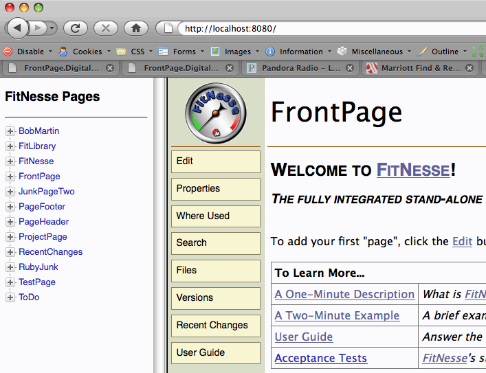
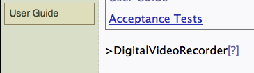
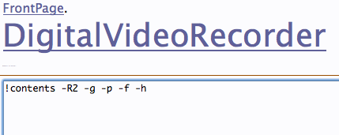
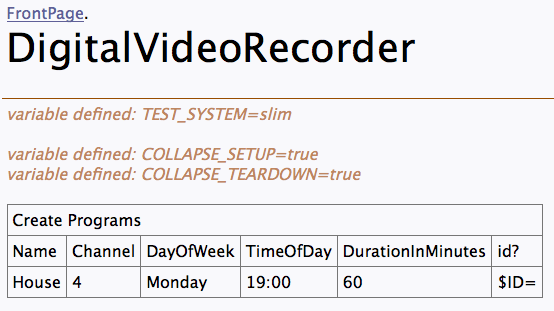
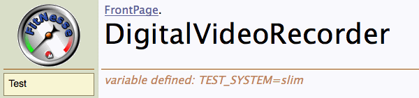
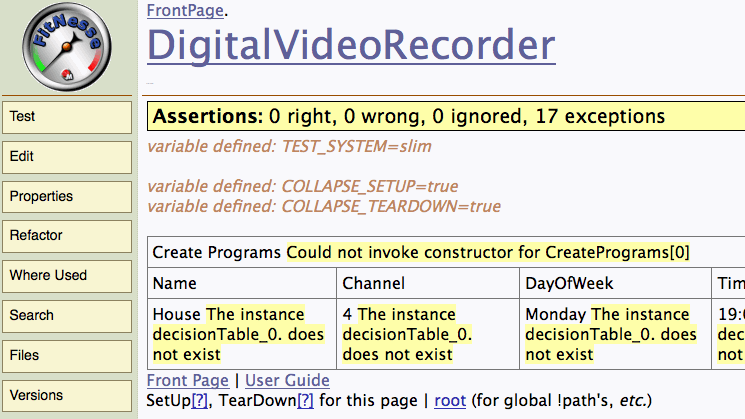

{:toc}
[<--Back](FitNesse.Tutorials)

# Install FitNesse
* Install a JVM 1.6 or later.
* [Download FitNesse](http://fitnesse.org/FrontPage.FitNesseDevelopment.DownLoad)
* Go to that directory and execute "java -jar fitnesse.jar -p 8080"


Macintosh-8% java -jar fitnesse.jar -p 8080
Unpacking new version of FitNesse resources.  Please be patient.
<many dots>
FitNesse (v20100103) Started...
	port:              8080
	root page:         fitnesse.wiki.FileSystemPage at ./FitNesseRoot
	logger:            none
	authenticator:     fitnesse.authentication.PromiscuousAuthenticator
	html page factory: fitnesse.html.HtmlPageFactory
	page version expiration set to 14 days.


* Verify you see a friendly FitNesse web page when you open [your browser here](http://localhost:8080/) (I built this from source and it might be different from what you see when you start FitNesse, but it should be close - you won't see the tree on the left until sometime in 4/2009)

# Configure FitNesse for Slim
* Click the **Edit** button on the home page. You will see something close to the following:


!1 Welcome to [[FitNesse][FitNesse.FitNesse]]!
!3 ''The fully integrated stand-alone acceptance testing framework and wiki.''

# Here is a good place to add your first page (WikiWord). For example, MyTopLevelApplicationPage
To add your first "page", click the [[Edit][FrontPage?edit]] button and add a [[!-WikiWord-!][FitNesse.WikiWord]] to the page.

| '''To Learn More...'''|
| [[A One-Minute Description][FitNesse.OneMinuteDescription]]|''What is [[FitNesse][FitNesse.FitNesse]]? Start here.''|
| [[A Two-Minute Example][FitNesse.TwoMinuteExample]]|''A brief example. Read this one next.''|
| [[User Guide][FitNesse.UserGuide]]|''Answer the rest of your questions here.''|
| [[Acceptance Tests][FitNesse.SuiteAcceptanceTests]]|''FitNesse's suite of Acceptance Tests''|

!note Release v20090311


* Above the last line (!note Release ...) add the following line:


>DigitalVideoRecorder


* Click **Save** and you should see something similar to this near the bottom of the page:

* Click on the [?], you'll see the following:

* Replace the !contents line with the following:


!define TEST_SYSTEM {slim}
 
!define COLLAPSE_SETUP {true}
!define COLLAPSE_TEARDOWN {true}
 
!|Create Programs                                        |
|Name |Channel|DayOfWeek|TimeOfDay|DurationInMinutes|id? |
|House|4      |Monday   |19:00    |60               |$ID=|


* Click **Save** and you should see something similar to the following:

* This is not yet a test page (if you create a test page whose name either ends or starts with "Test", FitNesse will make it a test page by default). To make it a test page, click on the **Properties** button.
* Change the Page Type to **Test** (if your version of FitNesse is older, you might simply put a check in the **Test** box).
* Click **Save Properties**. Now you should see the **Test** button:

* Click on the **Test** button, your test will fail with yellow (meaning something was not found) warnings:

 **//Note//**: If you get an error similar to "Testing was interrupted ...", add the following line to your page (this will probably only happen if you build from source):


!path fitnesse.jar


# [Continue Tutorial in Java](FitNesse.Tutorials.0.Java)
# [Continue Tutorial in C#](FitNesse.Tutorials.0.CSharp)

[#Congratulations](#Congratulations)
# Congratulations
Congratulations, you've finished the first tutorial. In this tutorial you:
* Installed FitNesse
* Created a Page
* Set the page to a Test Page
* Configured FitNesse to use Slim (instead of its default, which is fit)
* Used an import table to name a package to search when looking for Fixture classes
* Created a decision table that calls the CreatePrograms fixture
* Created a Java fixture class that Slim will execute
* Updated your page to include the path of your page
* Updated your Java fixture class to include all of the methods needed to handle each of the columns in your FitNesse Decision tables
* You've assigned the result of a method (the id() method) to a variable, ID.

# What's Next
* Continue working on the [next tutorials](FitNesse.Tutorials.1) (I recommend in the order listed). 
* Learn how to make tests that actually execute production code.
* Learn how to use a Table Table to implement a "fluent" or DSL-based table

[<--Back](FitNesse.Tutorials) -or- [Next Tutorial-->](FitNesse.Tutorials.1)
