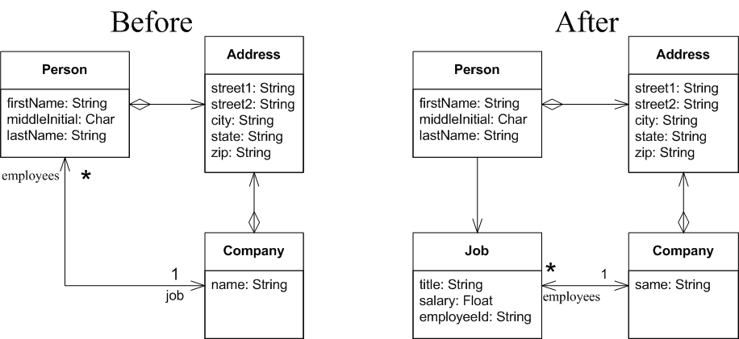

## Questions
* Describe what the @Entity annotation means to a class.
* Describe what the @Id annotation means to a class.
* Describe what the @GeneratedValue means to a class
* Describe the difference between @Embeddable and @Embedded
* In the previous section we mentioned using** mappedBy** to let the container know this was a bi-directional relationship instead of a unidirectional relationship. What does this even mean? Draw an instance diagram that would explain this difference.

## New Class
Right now the relationship between Person and Company is direct. Let's make that a little less direct. The Person should now have a Job with a title, salary and employeeId. The company still has employees as before. This picture describes the before and after relationships.

In order to refactor to the [above] "after" picture consider some of the following advice:

### Create Job
Create a class, Job, with the following attributes:

int id
String title
String Salary
String employeeNumber
Company company
Person person  // (added - ** fix diagram **)


### Update Employee
The Person class should no longer have a Company attribute. Instead it has a Job attribute.

### Update Company
Update Company.hire(). Change the signature to take a person, title, salary. It will then create the job, generate an employeeId, and set up all the relationships and return the job.

Update the Company.fire() as necessary.

### Advanced: Person can have multiple jobs
Make the relationship between Person and Job 1 to many. Now fix everything to make it work.

## Advanced: First cut at a Data Access Object
If you look at your various unit tests, there are several places were they perform direct queries, inserts and removes. Move all of the code behind one or more Data Access Objects. Update your unit tests to use the Dao's.
