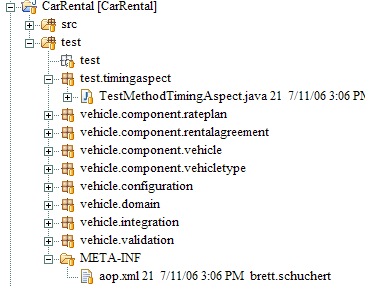

[<--Back](Some_Example_Aspects)

Some time ago I wanted to get a rough idea of which unit tests were taking the longest time to run so I could run those tests under a profiler and profile my code. We had tests that ran both in container and out of container so I decided to write all of the output to a log. The output looked like the following (I've rewritten the aspect for public consumption and applied it to an example I'm building for another class):

        47, vehicle.validation.MultiplicityValidatorTest.oneToMany1
         0, vehicle.validation.MultiplicityValidatorTest.oneToMany3
         0, vehicle.domain.PhoneTest.failureInvalidStation
        15, vehicle.domain.PhoneTest.failureInvalidExtension
      1172, vehicle.integration.IVehicleDaoTest.createVehicle
         0, vehicle.integration.IVehicleDaoTest.createDuplicateVehicle


The first column is 10 digits wide and is the number of milliseconds to run the **test** method. It does NOT include the time to run setUp() and tearDown() (or their equivalent [@Before](JUnit_4.xBefore) and [@After](JUnit_4.xAtAfter) methods.)

This example uses Log4J. To configure Log4J, I first used a [simple configurator](Commons_Logging_and_Log4j_Config). Then I programmatic ally set up an appender in the Aspect so that my logging configuration would not have aspect-based logging information in it (thereby keeping the crosscutting concern more localized).

The aspect and its associated aop.xml file are listed below. Before you can use them, you'll want to set up your environment(warning, you'll have to use your browser's back button to get back to here from these links):
* Download AspectJ [here](http://www.eclipse.org/aspectj/downloads.php).
* [Eclipse_VM_Configuration_for_AspectJ](Eclipse_VM_Configuration_for_AspectJ)
* [Eclipse_Classpath_Variable_for_AspectJ](Eclipse_Classpath_Variable_for_AspectJ)
* [Eclipse_Java_Language_Preferences_for_AspectJ](Eclipse_Java_Language_Preferences_for_AspectJ)
* [Eclipse_Java_Project_Preferences_for_AspectJ](Eclipse_Java_Project_Preferences_for_AspectJ)

Once you've done all of that, you'll want to put the Test Method Timing Aspect class in the same project where your test classes reside. You'll also need to create a META-INF directory directly under the source directory of your test classes and add the aop.xml file there. Here's an example of what my project looks like:
^

Notice that I have separate src and test directories. It turns out that both of these, when compiled, are merged into a common bin directory, so you can create the META-INF directory in either place. I've chosen to put it under the test directory. You'll also notice that I've put the project test.timingaspect under the test directory as well. (These projects are under [Subversion](http://schuchert.wikispaces.com/Subversion+on+XP), which might explain why my icons look different from yours in Eclipse.

If you do not use a src directory and just store your projects at the top level, then your META-INF directory will be directly under your project.

----
[#TestMethodTimingAspect](#TestMethodTimingAspect)
## TestMethodTimingAspect.java

01: package test.timingaspect;
02: 
03: import java.io.FileOutputStream;
04: 
05: import org.apache.log4j.Logger;
06: import org.apache.log4j.PatternLayout;
07: import org.apache.log4j.WriterAppender;
08: import org.aspectj.lang.ProceedingJoinPoint;
09: import org.aspectj.lang.annotation.Around;
10: import org.aspectj.lang.annotation.Aspect;
11: import org.aspectj.lang.annotation.Pointcut;
12: 
13: import vehicle.logging.LoggingConfiguration;
14: 
15: /**
16:  * A simple aspect that wraps test methods and reports the time to execute each.
17:  */
18: @Aspect
19: public class TestMethodTimingAspect {
20:     private Logger logger;
21: 
22:     public TestMethodTimingAspect() {
23:         try {
24:             logger = LoggingConfiguration.getLoggerFor(TestMethodTimingAspect.class);
25:             String outfileName = System.getProperty("user.home") + "/UnitTestTimings.txt";
26:             outfileName = outfileName.replace('\\', '/');
27:             System.err.println("Writing timings to: " + outfileName);
28:             System.err.flush();
29:             WriterAppender wa = new WriterAppender(new PatternLayout("%m%n"), new FileOutputStream(
30:                     outfileName, true));
31:             logger.removeAllAppenders();
32:             logger.addAppender(wa);
33:         } catch (Throwable e) {
34:             e.printStackTrace();
35:         }
36:     }
37: 
38:     @Pointcut("target(receiver) && execution(@org.junit.Test * *())")
39:     public void annotatedTest(final Object receiver) {
40:         // empty, this is a pointcut
41:     }
42: 
43:     @Pointcut("target(receiver) && execution(void junit.framework.TestCase+.test*())")
44:     public void testMethod(final Object receiver) {
45:         // emtpty, this is a pointcut
46:     }
47: 
48:     /**
49:      * Record the time before and after executing and log the results.
50:      */
51:     @Around("testMethod(receiver) || annotatedTest(receiver)")
52:     public void around(final ProceedingJoinPoint thisJoinPoint, final Object receiver)
53:             throws Throwable {
54:         final String className = receiver.getClass().getName();
55:         final String methodName = thisJoinPoint.getSignature().getName();
56:         final String qualifiedMethodName = String.format("%s.%s", className, methodName);
57: 
58:         final long start = System.currentTimeMillis();
59:         try {
60:             thisJoinPoint.proceed(new Object[] { receiver });
61:         } finally {
62:             final long end = System.currentTimeMillis();
63:             logger.info(String.format("%10d, %s", (end - start), qualifiedMethodName));
64:         }
65:     }
66: }

### Interesting Lines
^
|--|--|
| Line | Description |
|24|Use a [simple configurator](Commons_Loggins_and_Log4j_Config) to get a logging configuration.|
|25|Create an output file name that's based on the [Java user.home](http://java.sun.com/docs/books/tutorial/essential/system/properties.html) property. On my machine, this is the directory "C:\Documents and Settings\brett.schuchert". On a Unix machine, it will probably be equal to "~".|
|26|Dos uses \ and Unix uses /. Using / in Java works on both PC's and Unix boxes, so replace all of the \ with /.|
|27 - 28|Output where the log file is placing information to System.err. It will show up as red in Eclipse and I flush the output so it should appear somewhere near the top. You can safely remove this line once you know where the output goes.|
|29 - 30|Create a file appender based on the name we've already calculated. In my case, outFileName is "C:/Documents and Settings/brett.schuchert/UnitTestTimings.txt". **NOTE** This is a file appender, it will keep adding new timing information to the end of the file. If you want a clean run, you'll need to move the file, rename it, etc. (Or update this example.)|
|31|Remove all other appenders to this to completely control the output.|
|32|Add our appender as the only appender to this logger.|
|38 - 41|Define a pointcut that captures test methods annotated with @Test. (JUnit 4.x style test methods.)|
|43 - 46|Define a pointcut that captures methods named test*, that are in TestCase and all of its subclasses. (JUnit 3.8 style test methods.)|
|51|Around the execution of JUnit 3.8 or JUnit 4.x test methods, do the following.|
|54 - 56|Get the fully-qualified name of the method, e.g. vehicle.domain.PhoneTest.failureInvalidExtension.|
|58|Record the time just before executing the method.|
|60|Execute the test method.|
|61 - 64|Regardless of how the test method returns (normally, because of an exception), record the completion time and log the result.|
|63|Use the new String.format method to format my output.|

----
[#aop](#aop)
## aop.xml

01: <aspectj>
02: 	<aspects>
03: 		<aspect name="test.timingaspect.TestMethodTimingAspect"/>
04: 	</aspects>
05: 	<weaver>
06: 		<include within="vehicle..*"/>
07: 	</weaver>
08: </aspectj>

### Interesting Lines

|--|--|
| Line | Description |
|3|The fully-qualified name of an aspect. Add this aspect to the list of aspects to weave at runtime. If you change the name of the aspect or change its package, you must update this fully-qualified name.|
|6|The list of packages to be woven. You'll need to change this to match your packages. The part before .. is the beginning of the package names I used (see the picture above). The ..* means everything from that name down. So in my case, I have packages like vehicle.component and vehicle.validation and vehicle.component.validation, all of which match vehicle..*.|

[<--Back](Some_Example_Aspects)
