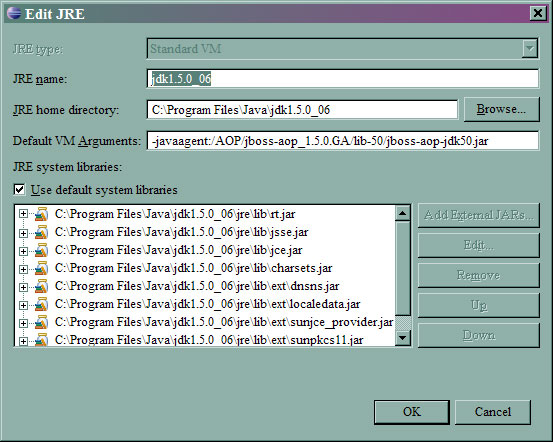

[<--Back](Environment_Configuration_for_AspectJ) [Next-->](Eclipse_Classpath_Variable_for_AspectJ)

Your goal is to configure the Java VM to include one additional parameter:

-javaagent:/AOP/aspectj/lib/aspectjweaver.jar


In Eclipse:
* Pull down **Windows**
* Select **Preferences**
* Select **Java**
* Select **Installed JREs**
* Double-click on **Java 1.5.x JDK** (you'll see the below image)
* In **Default VM Arguments:** enter the **value:** -javaagent:/AOP/aspectj/lib/aspectjweaver.jar
* Adjust the directory to where your version of AspectJ is installed
(Note, this image actually shows the configuration for JBoss AOP. It's the same procedure, just a different value in the **Default VM Arguments:**

[<--Back](Environment_Configuration_for_AspectJ) [Next-->](Eclipse_Classpath_Variable_for_AspectJ)
