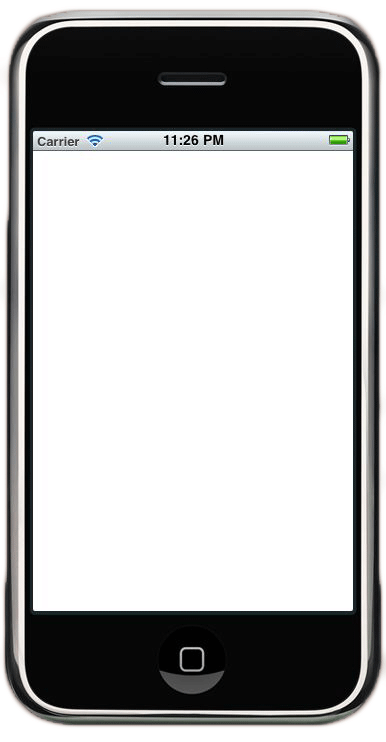
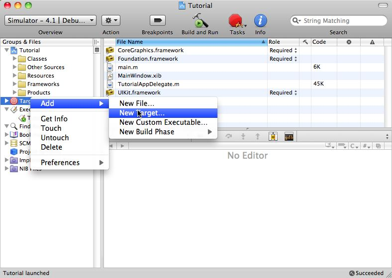

[<-- Back]({{ site.pagesurl}}/iPhone)

# The Video
[media_type="custom"_key="8643826"]({{site.pagesurl}}/media_type="custom"_key="8643826")

# Basic Application Setup
These notes are for XCode 3.2.2. Given that Apple has messed up Unit Testing in this version, you can assume these steps are fragile. If they fail for you, please send me an email (schuchert -at- yahoo -dot- com) and let me know the version of XCode you are using. I'll see if I can figure it out. If you've solved the problem, let me know and I'll update these notes. Or, if you are feeling ambitious, I'll give you permission to update the notes.

* Start XCode and create a new project (//**File:New Project**//, or command-shift N)
* Select //**iOS:Application**// on the the left part of the screen (it is probably the default selection)
* Select //**Windows-Based Application**// on the right
* Select your device type. It is probably iPad (by default), but I chose //**iPhone**// for this example. It's a sticky selection, however, so it will probably be your last setting.
* Provide a name and a location. For this example, I'll use //**/Users/schuchert/src/ObjectiveC**// as the directory and //**Tutorial**// as the name.
* You should now be able to run your application. Use command-r to see that your application runs, bringing up the simulator (quit the simulator when you're done or at least switch back to XCode):


# Adding GH-Unit
* Download GH-Unit [from here](https://github.com/gabriel/gh-unit/archives/master).
* Unzip this file. For this example, I'll unzip it to// **/Users/schuchert/src/iPhone/Libraries**//. This will create the directory// **GHUnitIOS.framework**// under that directory.

What follows derives heavily from [the gh-unit documentation](http://gabriel.github.com/gh-unit/_installing.html).
# Add a new Target
* Add a new target to your project. Right-click (control-click) on //**Targets**// and select //**Add:New Target..**//


* Select //**iOS:Cocoa Touch:Application**//
* Give it a descriptive name, for this tutorial I'll use //**UnitTests_onIPhoneSimulator**//
* Add the following frameworks in the following dialog that pops up:
** GHUnitIOS.framework
** CoreGraphics.framework
** Foundation.framework
** UIKit.framework
* To add the first one, under "Linked Libraries", click on //**+**// then //**Add Other...**//
* You'll find the framework where you just unzipped it (//**/Users/schuchert/src/iPhone/Libraries**// in my case.)
* The other three are listed under the Device list.
Note that manually finding the GHUnitIOS.framework directory added a Framework Search Path entry. To see it, go to the //**Build**// tab. Next, scroll down to //**Search Paths**//. Finally, review //**Framework Search Paths**// and notice the inclusion of the physical directory that contains GHUnitIOS.framework.
* Now it's time to set a few linker flags. Again, under the //**Build**// tab scroll to //**Linking**// (it's roughly in the middle). Then double-click on //**Other Linker Flags**//
* Add: -ObjC
* Add: -all_load
* Close that dialog.
* Find the file //**UnitTests_oniPhoneSimulator-Info.plist**// and edit it. You'll find an entry at the bottom, //**Main nib file base name**// with the entry //**MainWindow**//. Simply remove the value (clear the field).
* Add the //**GHUnitIOSTestMain.m**// to your project. You can find a copy on github [here](https://github.com/gabriel/gh-unit/raw/master/Project-IPhone/GHUnitIOSTestMain.m)
* To do this:
** Download the file somewhere (my download location is// **~/Downloads**//)
** Expand //**Targets**//
** Select your target name, mine is //**UnitTests_oniPhoneSimulator**//
** //**Right-click:Add:Existing Files...**//
** Find// **GHUnitIOSTestMain.m**// and double-click it (find your download location)
** On the next dialog, check //**Copy items into destination group's folder (if needed)**//
** Make sure that the right Target is selected. In my case this means //**UnitTests_oniPhoneSimulator**// is selected, but //**Tutorial**// is not selected.
** Click //**Add**//
* Change the active target to the new target:
** Pull down //**Project:Set Active Target**//
** Select your unit test project.
** Build, command-b
** Run, command-r
** When the simulator starts, click on //**Run**//. There are no tests, so it finishes quickly.

# Add a first test
* Under //**Targets**//, right-click  //**UnitTests_oniPhoneSimulator**//
* Select //**Add:New File**//
* Under //**iOS:Cocoa Touch Class**//, just select //**Objective-C class**//
* Click //**Next**//
* For the name, enter //**ItShouldHaveSmoke.m**//
* For Unit Test files, I do not create a header and source file, but just a source file. So uncheck //**Also create "...".h**//
* Verify that only the correct target (UnitTests_oniPhoneSimulator) is selected.
* Click //**Finish**//
* Enter the following test code:

```obj-c
//
//  ItShouldHaveSmoke.m
//  Tutorial
//
//  Created by Brett Schuchert on 11/9/10.
//  Copyright 2010 Brett L. Schuchert. Use at will, just don't blame me.
//

# import <GHUnitIOS/GHUnitIOS.h>

@interface ItShouldHaveSmoke : GHTestCase {
    NSString *someVariableToInitialize;
}
@end

@implementation ItShouldHaveSmoke

-(void)setUp {
    someVariableToInitialize = @"Hello World";
}

-(void)tearDown {
    someVariableToInitialize = nil;
}

-(void)testThatItDoesHaveItsSmoke {
    GHAssertEquals(@"", someVariableToInitialize, nil);
}
@end
```

* Build, command-b
* Run, command-r
* You should see the simulator start. If you still had it running, XCode will warn you that it needs to stop the simulator. Select //**OK**// to do so.
* When the simulator starts, click //**Run**//
* Oops, the test is failing.
* go back and edit your code. Chang the single assertion to:
```
    GHAssertEquals(@"Hello World", someVariableToInitialize, nil);
```
* Build and re-run, hit command-r
* Run the test suite again.

Congratulations, you have your first test working.
# Set Unit Test Executable Settings

Review// **GHUnitIOSTestMain.m**//. Notice that it recommends editing your unit test executable and setting the following properties:
|~ Property Name|~ Default Value|~ Recommended Setting |
|NSDebugEnabled|                        NO      |YES|
|NSZombieEnabled|                       NO       |YES|
|NSDeallocateZombies|                   NO       |YES|
|NSHangOnUncaughtException|             NO       |YES|
|NSEnableAutoreleasePool|YES|NO|
|NSAutoreleaseFreedObjectCheckEnabled|NO|YES|
|GHUNIT_AUTORUN|NO|YES|

Note, the last one is one I recommend. This will make your tests run automatically.

To make create these environment settings:
* Expand// **Executables**//
* Select your unit test executable (//**Unit Tests**//
* Right-click, Get Info (command-I)
* In the bottom window, click the +, add a field and set its value
* Re-run your tests to make sure they work as expected

Now the hard part starts.

# Now Really Setting Things Up
<<to be expanded>>
* Create a new static library for your model code (keep model separate from UI
* Link to it from the UI project
* Link to it from the Unit Test Project
# A Few Handy Shortcut Keys

| Command-r | run application |
| Command-b | quick open |
| F3 | mapped to Edit:Find:Jump to Definition |
| Command-alt up-arrow | Switch between .h and .m |

[<-- Back]({{ site.pagesurl}}/iPhone)
