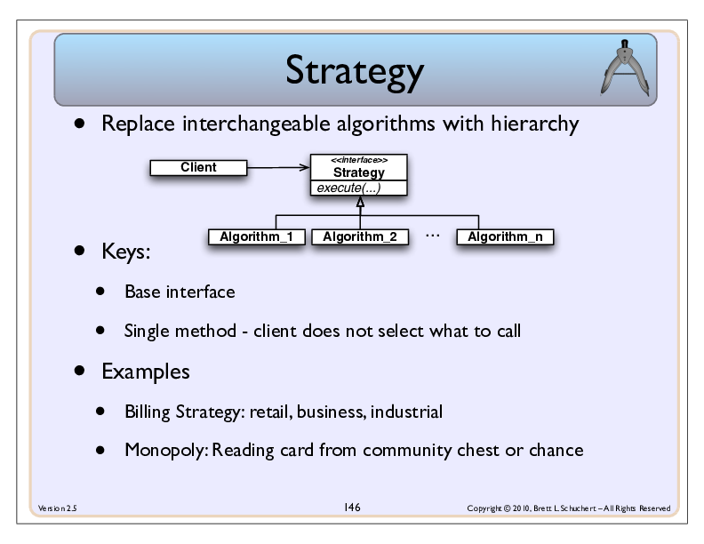
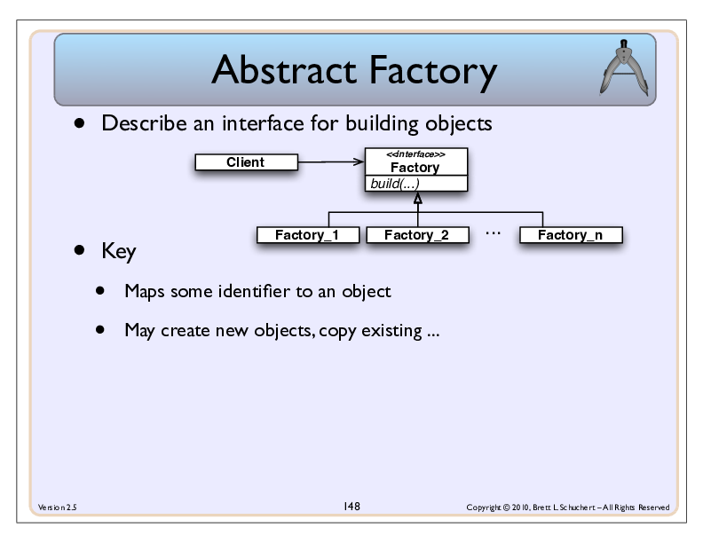
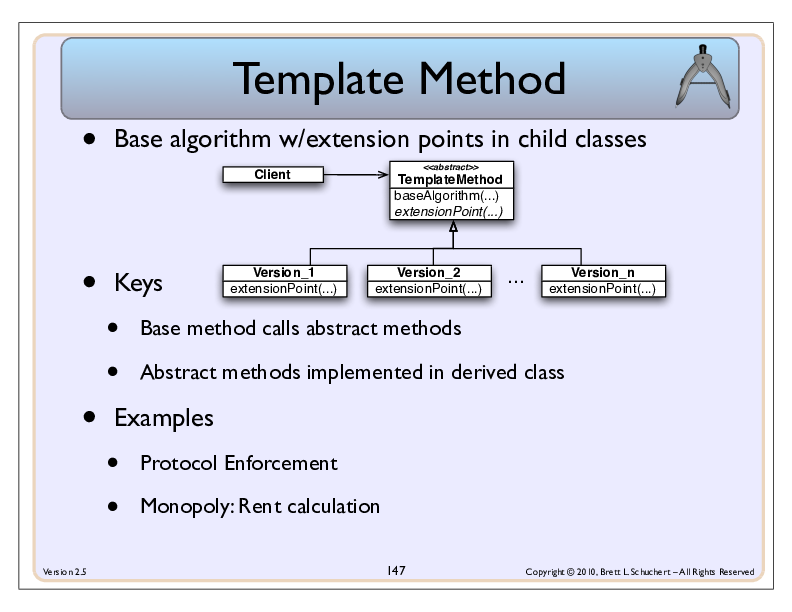
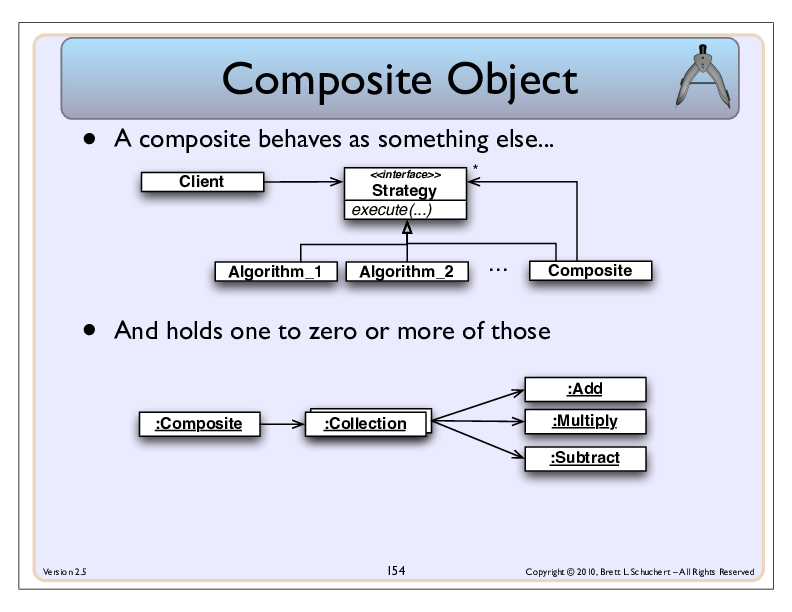



<section>
## Overview
These instructions give further details on a set of exercises in a [github repo](git@github.com:schuchert/rpn_pattern_practice.git).

That repo is to practice different kinds of code refactorings. There are several exercises, each of which starts at a git tag in the repo.

The current tags (in the order I'd recommend using):
* wrap-collection-start
* open-closed-start
* strategy-pattern-start
* template-method-start
* composite-method-start (tbd)

</section>

<section>
## Working with the repo
You will need to install a few things for this to work. Have a look [here](https://schuchert.github.io/wikispaces/pages/java/project.from.scratch/using.gradle.html#prerequisites).
Note, you will not need gradle installed as described [there](https://schuchert.github.io/wikispaces/pages/java/project.from.scratch/using.gradle.html#prerequisites).

In addition, you probably want to install some IDE. [Eclipse](https://www.eclipse.org/downloads/),
[IntelliJ Comunity Edition](https://www.jetbrains.com/idea/download/), or [NetBeans](https://netbeans.org/downloads/) should work.

Once you have a command line, git, and an IDE, you are ready to:
* Clone the repo (do this once)
* Select an exercise and work on it (once per exercise)
* Move to the next exercise to either review one possible solution or start another exercise

### Cloning Repo

Clone this project as usual and review the tags:
```terminal
git clone git clone git@github.com:schuchert/rpn_pattern_practice.git
cd rpn_pattern_practice
git tag -l
```

**todo: add in list of branches once they are all there**

### Select an exercise

In the repo directory, use git branch with a tag to create a branch based on one of the exercises, i.e.,
```terminal
git checkout -b <new_branch_name> <tag_name>
```

For example, to work on the (recommended) first exercise:
```termainl
git checkout -b wrap-collection-exercise wrap-collection-start
```

You can now make commits to this branch as you normally would use git.

### Move to the next exercise

Once you are done, you can move to the next exercise in order to see one possible solution to the problem
presented in the exercise.

Before doing that, commit any changes you want to keep in the branch created for this exercise.

To review one possible solution to ```wrap-collection-start``, compare your results with the tag after it, which is ```open-closed-start```:
#### Currenntly Clean
```terminal
vagrant@vagrant-mint19:~/src/rpn$ git status
On branch wrap-collections-exercise
nothing to commit, working tree clean
```

#### Compare to one possible solution
```
git diff open-closed-start
```
#### Switch to tag
Now review [select an exercise above](#select-an-exercise).

</section>

<section>
## Tag: wrap-collection-start
Direcly using the regular Stack class in Java for this project violates the
[Dependency Inversion Principle](https://en.wikipedia.org/wiki/Dependency_inversion_principle).

An Rpn Calculator never runs out of values. If your regular Java stack runs out of values,
trying to `pop()` or `peak()` values throws an exception.

We want to make our stack never empty. Technically the value returned should reflect the so-called
T register. We will simplify this and instead return 0 when all the user-entered values are gone.
(See [Rpn Description](https://schuchert.github.io/wikispaces/pages/Rpn_Calculator_High_Level_Description.html) for too much detail.)

Introduce a new class, RpnCalculator. This class will wrap the ```Stack<BigDecimal>```. Then update
the ```RpnCalculator``` to use this new class.

</section>

<section>
## Tag: open-closed-start
The interface to the calculator changes every time you add a new operator.
This violates the [Open/Closed Principle](https://schuchert.github.io/wikispaces/pages/ruby/ruby.tutorials.bdd.UsingBddToDevelopAnRpnCalculator.html#openclosed)
Experiment with making a change to the API and get the code to pass.

### Goals
* Adding a new operator does not change the interface to the calculator
* All exisitng operators use the new approache
* The number of methods on the classs is significantly reduced
* Introduce some negative testing to make sure use of the new API produces "reasonable" errors


If you want a hint look below.

### Before
```java
    @Test
    public void addsNumbersCorrectly() {
        calculator.enter(BigDecimal.valueOf(13));
        calculator.enter(BigDecimal.valueOf(-2));
        calculator.add();
        assertEquals(BigDecimal.valueOf(11), calculator.x());
    }
```

### After
```java
    @Test
    public void addsNumbersCorrectly() {
        calculator.enter(BigDecimal.valueOf(13));
        calculator.enter(BigDecimal.valueOf(-2));
        calculator.execute("add");
        assertEquals(BigDecimal.valueOf(11), calculator.x());
    }
```


^
</section>

<section>
    
## Tag: stragety-pattern-start
All of the operators look similar. Rather than writing each as its own function, we can
do the same thing as a class. Note: With Java 8 we could also use Lambdas, but for now
let's take more of a traditional approach to the Stragegy Pattern.


We want to define an interface with a single method that will work all of the operators.
Review each of the operators, and determine what, if anything, is common across all
operators.

Once you've done that, create an appropraite interface, have each of the functions in
its own class, which implements that interface.

Update the solution from calling a bunch of functions to instead using instances of
the various subclasses of your new interface.

As a bonus, use some kind of reflection to find the operators rather than having to
manually create them.
^
</section>

<section>
## Tag: factory-pattern-start

**Note in current repo, will redo**
There's an abundance of code in the `RpnCalculator` that can be put into its own class.
^
</section>

<section>
## Tag: template-method-start

Notice duplication acrosss binary operators. How can we remove that duplication?
^
</section>

<section>
## Tag: composite-pattern-start


What if I want to compose simple operators to make more complex operator, a program
or a macro if you will.
^
</section>
