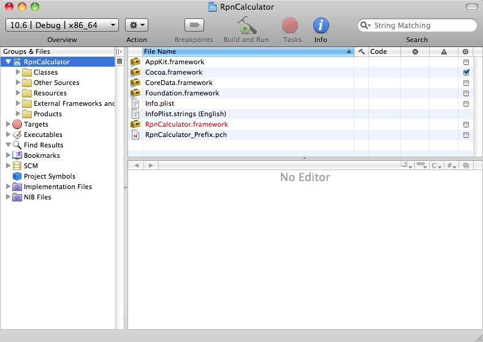
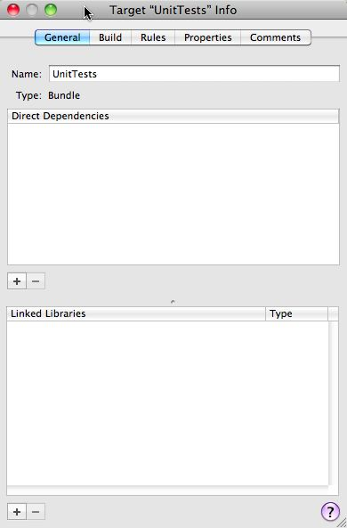
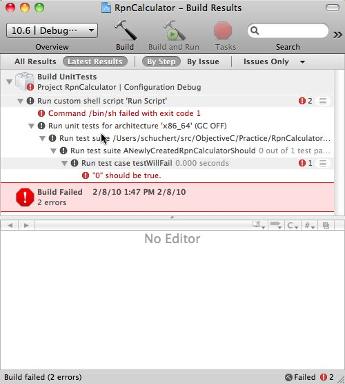
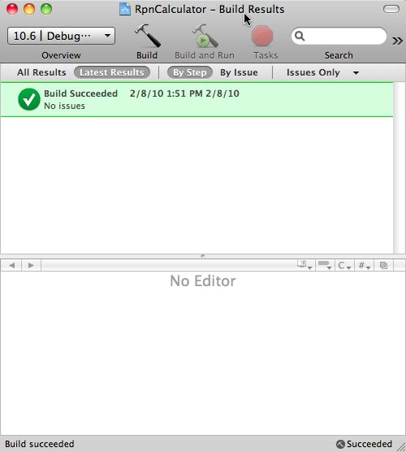
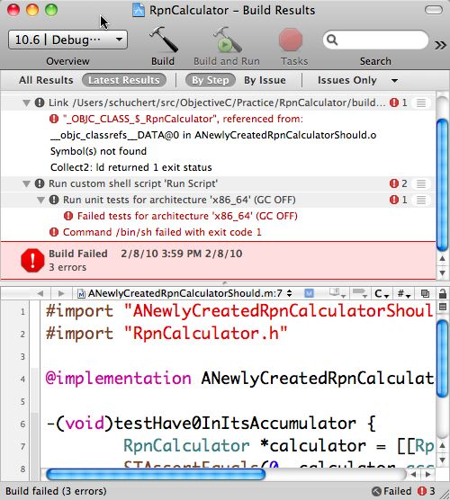
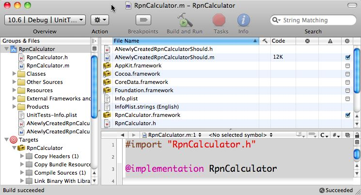
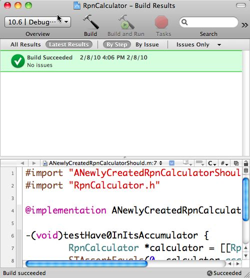

## Why?
It took a bit of digging to come up with the steps required to get basic unit testing working in XCode. These steps borrow heavily from the following sites (in no order, because I don't remember what all it took to get this working):
* <http://chanson.livejournal.com/182472.html>
* <http://developer.apple.com/tools/unittest.html>
* <http://www.devworld.apple.com/mac/library/documentation/DeveloperTools/Conceptual/UnitTesting/Xcode_Unit_Testing.pdf>

Much of my confusion comes from the difference between using "raw" Objective-C (relatively easy) versus XCode and all that implies. In any case, that's the environment I'll be using for courses, so that's what I need to be able to get working.

## What These Steps Describe
Technology:
* XCode 3.2.1
* The OCunit framework built-in to XCode 3.2.1
* Cocoa Framework
* Snow Leopard, though I suspect this will all work under any variant of 10.3 or later

These steps describe what you'll need to do to set up a framework, not an application. If you want to set up an application, review either of the bottom two links in the Why section.

## Video Version
[media_type="custom"_key="5352763"]({{site.pagesurl}}/media_type="custom"_key="5352763")

## Setting up Project
* In XCode create a new project:// **File:New Project**// or// **Command-Shift-N**//
* Under the// **Mac OS X Templates**//, select// **Framework & Library**//
* Select// **Cocoa Framework**// on the right-side, top pane and either click// **Choose**// or double-click
* In the// **Save As**// box, enter a project name. I'll be using// **RpnCalculator**//
* Select the directory under which to create your project. I'll be using// **/Users/schuchert/src/ObjectiveC/Practice**//
* Click// **Save**//

At this point, you should have a window that resembles the following:


## Configuring for Unit Tests
* Under// **Groups & Files**//, select// **RpnCalculator**// and// **right-click**// (ctrl-click), select// **Add:New Target**//
* Under// **Max OS X**//, select// **Cocoa**//
* In the top-most right pane, select// **Unit Test Bundle**// and either// **double-click**// or click// **next**//
* Under// **Target Name**// enter some descriptive name. I'll use// **UnitTests**//.
* Click// **Finish**//
* This should bring up the info window on the target:

* Under the Direct Dependencies pane, click the// **+**// and add a dependency to// **RpnCalculator**// (double-click on// **RpnCalculator**//)
* Close the info window

## Adding a Test Fixture
Now you'll add a simple fixture with a failing test, then get the test to pass.

* Create a new File,// **File::New**// or// **Command-N**//
* Select// **Cocoa class**// under// **Mac OS X**//
* In the upper-most right pane, select// **Objective-C test case class**//
* Click// **Next**// (or double-click)
* Under the** //File Name**// enter some sensible test name (making sure to leave the ".m" at the end of the name alone). I'll be using// **ANewlyCreatedRpnCalculatorShould**//
* Under the// **Targets**// make sure to select// **UnitTests**// and to unselect// **RpnCalculator**//
* Click// **Finish**//

## Create a Failing Test
* Update ANewlyCreatedRpnCalculator.h to resemble:
```c
# import <SenTestingKit/SenTestingKit.h>

@interface ANewlyCreatedRpnCalculatorShould : SenTestCase {
}

@end
```

* Update ANewlyCreatedRpnCalculator.m to resemble:
```c
# import "ANewlyCreatedRpnCalculatorShould.h"

@implementation ANewlyCreatedRpnCalculatorShould

-(void)testWillFail {
	STAssertTrue(0, @"");
}

@end
```

## Build to run the test
Let's assume the for building you'll want to run the tests every time.
* Pull down the// **Project**// Menu, select// **Set Active Target**// and pick// **UnitTests**//
* Bring up the// **Build**// window:// **command-shift-B**// or// **Build:Build Results**//
* Click// **Build**//
* The test should fail:


## Get the test to pass
* Update the assertion line in ANewlyCreatedCalculatorShould from:
```c
	STAssertTrue(0, @"");
```
To:
```c
	STAssertTrue(1, @"");
```
* Save and re-build.
* All tests should be passing:


## Really Getting it all Tied Together
Now it's time to get the RpnCalculator framework linked into the test target. 
* Update the unit test (in ANewlyCreatedCalculatorShould.m):
```c
# import "ANewlyCreatedRpnCalculatorShould.h"
# import "RpnCalculator.h"

@implementation ANewlyCreatedRpnCalculatorShould

-(void)testHave0InItsAccumulator {
	RpnCalculator *calculator = [[RpnCalculator alloc] init];
	STAssertEquals(0, calculator.accumulator, @"");
	[calculator release];
}

@end
```

This example imports a type that does not yet exist. So add it:
* Create a new file:// **File:New**// or// **Command-N**//
* Select// **Cocoa Class:Objective-C class**//
* Click// **Next**//
* Under// **File Name:**// enter:// **RpnCalculator**// making sure to leave the ".m" in place.
* Under the// **Targets**// section, select// **RpnCalculator**// and de-select// **UnitTests**//
* Click// **Finish**//
* Edit// **RpnCalculator.h**//:
```c
# import <Cocoa/Cocoa.h>

@interface RpnCalculator : NSObject {
	int accumulator;
}

@property (readonly) int accumulator;

@end
```
* Edit// **RpnCalculator.m**//:
```c
# import "RpnCalculator.h"

@implementation RpnCalculator

@synthesize accumulator;

@end
```

If you build now, you will get a linking error. Try it:


To Fix this:
* In the main window, under// **Groups & Files**//, select// **RpnCalculator**//
* In the top-most right pane, you'll see a list view; the first column has the name// **File Name**//.
* Scroll down until you see// **RpnCalculator.framework**//
* On the far-right side of that pane is a column with check boxes. Find the check box for the row containing// **RpnCalculator.framework**// and enable it:

* Build again (Command-Shift B, click the build button)
* You should have a successful build:


## Congratulations
You have a project configured to run unit tests when built.
* You can add "production" code to RpnCalculator and unit tests code to UnitTests.
* By default, a build will build the RpnCalculator framework, then UnitTests and then execute the unit tests.
At this point, you can continue practicing Test Driven Development.
