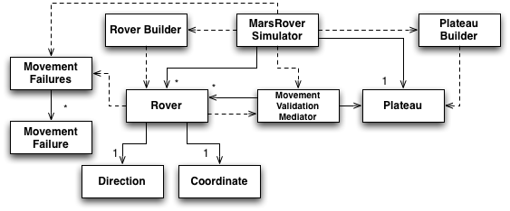

## Getting Started
I sent you a zip of the Eclipse project directory. While you can follow these steps, you can also ignore all of this and [skip ahead](tw_interview.notes#skipahead).
### Get the source
The project resides on [github](https://github.com/schuchert/tw_coding_interview). To acquire the source, you can do the following:
* git clone git://github.com/schuchert/tw_coding_interview.git
  * This creates a directory called tw_coding_interview under the current directory

### Build & Run the Tests
I used gradle as my build tool. To build and run the tests:
* [Install gradle](http://gradle.org/installation.html)
* cd tw_coding_interview/rover - the directory created from the git clone above
* gradle test

### Work in Eclipse
* gradle eclipse - this creates the necessary . files
* Start eclipse
* For your project directory, use the full path to the tw_coding_interview directory created above
* Import the rover project

{: #skipahead}
## The Code
There is a main program that reads from an input file and writes output to System.out: com.tw.rover.main.Main. If you run that program you will see the expected output. You can also create other text files and provide their names (one per execution) as an optional command line parameter. This code is lightly tested by com.tw.rover.main.MainTest in the src/test/java source tree.

There were no specific requirement for things like:
* Input validation
* Movement off the Plateau
* One rover hitting another

I took the liberty of validating such things. If you'd like to see some of these checks, have a look at:
* MarsRoverSimulatorNegativeTest
* MovementValidationMediatorTest
* PlateauGracefullyHandlesBadInputTest
* StringUtilsTest

I treated setup of the Plateau and Rovers as all or nothing and I used exceptions to make that simple. However, I took a different approach for movement. I took the approaching of reporting all errors that occur. When moving, if a rover encounters an error (off the Plateau or hitting another rover) it simply stops and that error is recorded. If there are multiple rovers, each rover gets its chance to move. There is one unit test to demonstrate this: MarsRoverSimulatorNegativeTest#attemptToMoveOffGridDoesNotStopSecondRover.

Here's a listing of the production classes and a one-liner describing each:

|~ Name |~ Intention |
|Coordinate|Represents a read-only X,Y value independent of whether it makes sense on the Plateau. Given a direction it can calculate a new Coordinate.  |
|Direction|A somewhat cute Enumeration. It has N,E,S,W for the directions and it stores x and y offsets to assist in next coordinate calculations. Also, it can calculate left and right from a given direction.|
|InvalidCommandStream|A RuntimeException for something in a command stream that is not understood.|
|InvalidCoordinates|A RuntimeException for a number that is meant to be read as an int for a coordinate but cannot be parsed.|
|MarsRoverSimulator|The "system" class. It contains a list of rovers and a plateau, which it builds (indirectly) from a BufferedReader.|
|MovementFailure|A read-only object describing one failed movement.|
|MovementFailures|A wrapped collection of the above.|
|MovementValidationMediator|Knowing if a calculated coordinate is safe (on the grid, not going to hit a rover) requires coordination of a lot of different classes. I created the mediator test-first and then updated movement to use it to validate safe movement.|
|Plateau|It represents a grid with 0,0 at the lower-left and a provided X,Y as the upper right corner.|
|PlateauBuilder|Used by the MarsRoverSimulator, it takes the input stream and builds just the Plateau from the input stream.|
|Rover|Represents one rover with a coordinate and a facing direction.|
|RoverBuilder|Used by the MarsRoverSimulator, it takes the input stream and first creates a rover and the associates a command stream (e.g., MMRMMR) with the rover just created.|
|StringUtils|A simple class to capture some basic string manipulation.|

### Class Diagram
This is a class diagram showing most of the classes listed above. This gives a general sense of dependency and containment and may help guide you through the code:

## What Remains
This code takes a lot of liberty with negative tests. Since the instructions hinted at validation with tests and suggested clarification from the recruiter, I decided to take the liberty of somewhat aggressive input validation. In the real world, I'd do this as well but I'd try to get the domain expert involved throughout.

I considered creating some automated tests with FitNesse but it seemed like overkill. However, visually drawing out an initial grid with rover locations, I think, would make for some compelling communication examples.

There is a circular reference between Rover and MovementValidationMediator. I don't like circular references. One solution is to extract an abstract class (not interface) called LocationBasedObject that has both a coordinate and the isAt method. This is a small matter of refactoring in Eclipse/NetBeans/IntelliJ and I'm worried that I've already over done this a bit. However, I'm happy to do that.

The Rover#process method uses a switch to handle the different movement commands. This is a candidate for a Factory of Strategies. The strategies are things like "MoveLeft", indexed by "L" and "Move", indexed by "M". This is a 3 minute refactoring and, as before, I was concerned about over design and overkill. While this approach better fits with the Open/Closed Principle, there's not enough to know if the protocol will change. In reality, if this were an embedded system, updating code on the fly may be a reality and such a design might be OK. I suspect, however, that to not be the case with the real Mars Rover. In any case, it's a quick refactoring and I'm happy to submit a version with this refactoring applied.

At one point I ran Emma on the code to check my coverage. It did find some uncovered code, a result of some refactoring. I had moved responsibility from Plateau to MarsRoverSimulator but neglected to delete the old methods. There were a few places were Emma reported things I had not executed (e.g., constructor of StringUtils, which has all static methods). I decided to just get to 100% coverage. This was somewhat silly, but I was on an airplane and had the time. Those tests are named appropriately (I hope), e.g., removeFalseCoverageInformation.

The Main() class was a bit of an afterthought. I could break it up. I don't have a lot of information on this planned usage of this program to know how to refactor it, so I've left it as is for now. It works, it's cyclomatic complexity is low (3 I think) and a few refactorings cold break it up nicely. It is, however, fully covered and it basically works. 

I put a few public final fields in just to see what reaction I get. I don't see this as essential, but rather a style issue or a coding standard issue. However, it's not something I'd strongly defend unless I was in a ornery mood.

The exceptions have a hard-coded serial version id. Object serialization in Java is fundamentally broken with respect to versions. Furthermore, relying on it for more than short-term storage is dubious. Since Eclipse warns me if the class is missing a value, I use 1L. I have done this for years, on real projects that have been and continue to be in production. I have come across issues where not providing one and working with certain containers (WebSphere) causes a class cast issue because of the way in which different VM's from different manufacturers calculate a different default value. So I always specify it. As for its particular value, it seems to me to be a smell if it's over-specified.

The coordinates class has an equals() methods. For this particular example, a hashCode() method is not necessary because I'm not putting them in a hash map. Even so, when I define equals I prefer to define hashCode. I created an arbitrary function that would (I hope) distribute values OK but without a large enough system, it won't make a bit of difference.

I created a few TestDoubles here and there. I considered using Mockito (my preferred tool for Java) but I rolled them by hand. This rears its ugly head in MainTest where, since I wrote main() to write to System.out, and I want to capture that output, I create an anonymous inner class of PrintStream, which necessitated creating an anonymous inner class of OutputStream. I would have switched to Mockito on the spot but I needed to update my Build.gradle and use it to acquire the library (rather than just duping it directly into the project). Since I was on a plane, that wasn't possible so I just wrote it by hand. This could be improved in several ways:
* Use Mockito
* Rather than referring to a static field, System,out, use an OutstreamFactory whose default is to return System.out but it can be overridden in a test to return a test double, which I'd still want to create using Mockito
While this is a fine idea: 1. don't want to over do it any more. 2. As with the other refactorings, this is quick and easy. 3. If I want to make the change, I have tests to support it.
